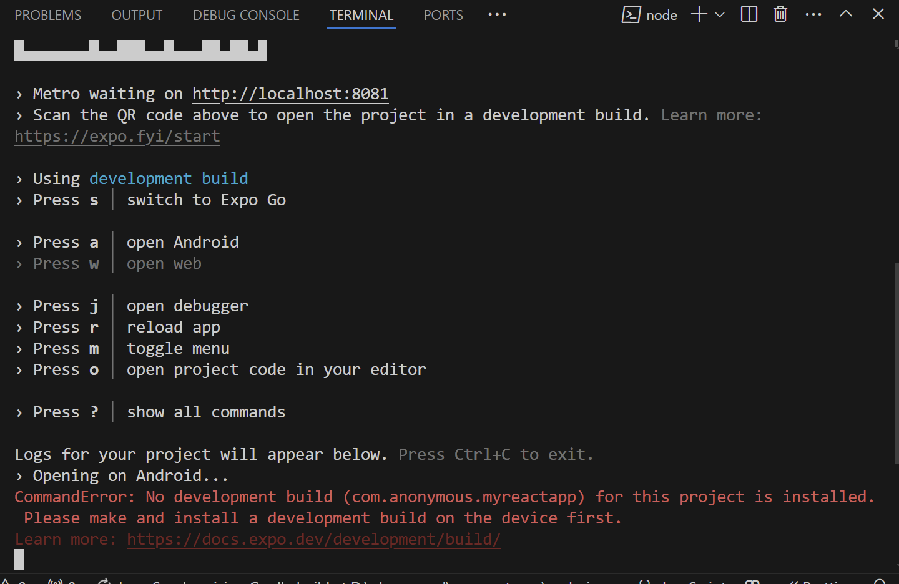
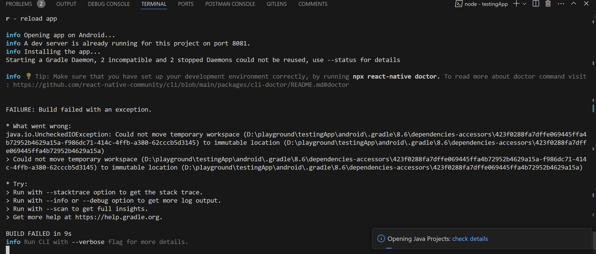
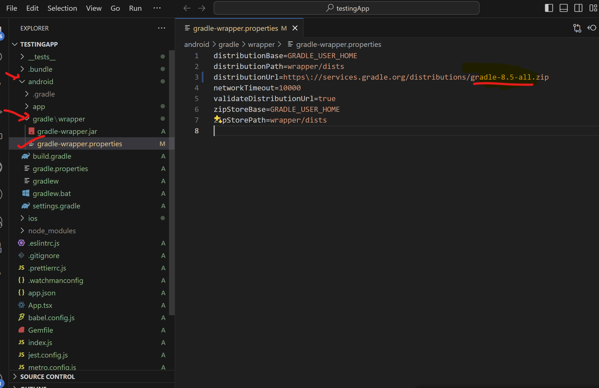

# react-native-starter-doc

Step by step guide to get start with react-native project

- Flow this [youtube paylist](https://www.youtube.com/playlist?list=PLC3y8-rFHvwhiQJD1di4eRVN30WWCXkg1)

# Initializie project

**Setup the project**
There are three ways you can setup the react native project

- **With Framework**

Framework like **expo**

```sh
npx create-expo-app@latest
```

> Note: **Floder sturcture** > [Create-expo-app floder structure](./assests/create-expo-app-floder.png)

- **Without Framework** [React native official website](https://reactnative.dev/docs/getting-started-without-a-framework)

Direct using simple **react-native-community/cli templete**

```sh
npx @react-native-community/cli@latest init <project-name>
```

> Note: **Floder sturcture** > [react-native-community Floder structure](./assests/react-native-community-floder.png)

- **With create-react-native templete** [GitHub repo link](https://github.com/expo/create-react-native-app)

```sh
npx create-react-native-app
```

> Note: **Floder sturcture** > [create-react-native-app floder structure](./assests/create-react-native-app-floder.png)

inplace of project-name give the project a name

---

### While initialization of react native project

By default it used yarn (if you have installed **yarn globally** or you have **enable corepack**) and if you haven't installed yarn by any ways it will take npm

# Run the app using npm

Simply change in developemet build you can resolve this erro

To run the app

```sh
npm start
```

To run the app in android Emulators **Press a** while app is runing

```sh
a
```

## There are some error you may face during runing the app

- Create Expo app gives you below error



To change the developement buid **Press s** [stackoverflow link](https://stackoverflow.com/questions/73384324/the-development-client-com-reactnative02-for-this-project-is-not-installed-pl)

```sh
s
```

- Create react native app gives you below error :-



Solution given in this [Stackoverflow](https://stackoverflow.com/questions/78384724/react-native-error-java-io-uncheckedioexception-could-not-move-temporary-work)

You have to lower the gradle version from 8.6 to 8.5. Also if you are using **Yarn** then you may not face this issue


